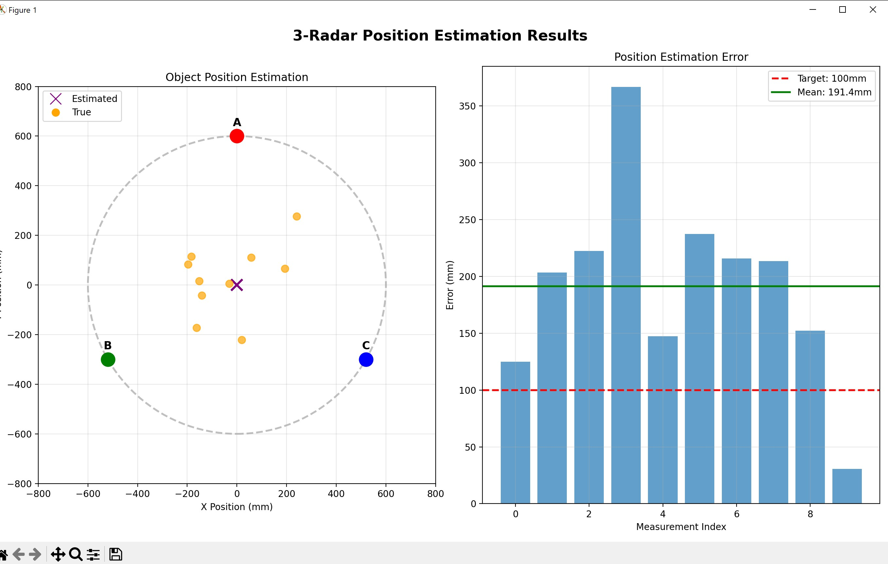

This project is part of the AIMlearning project, which is co-funded by the European Union. The project will run from 1.2.2024 to 30.4.2027.
# -Radar Millimetre-Wave Object Position Estimation

A Python-based solution for estimating object positions within a circular monitoring area using three millimetre-wave radar sensors.

## Problem Overview

A quality control system uses three millimetre-wave radars positioned at the vertices of an equilateral triangle on a circle (radius: 600mm). Each sensor measures the intensity of reflected waves at different distances, producing distance-intensity waveforms. The goal is to estimate the object's (x, y) position within the circle with an error < 100mm.

## Solution Architecture

```
project/
├── src/
│   ├── loader.py              # Data I/O and JSON parsing
│   ├── preprocessing.py       # Signal smoothing and normalization
│   ├── distance_estimation.py # Waveform → distance conversion
│   ├── trilateration.py       # Position calculation from distances
│   ├── visualization.py       # Plotting and diagnostics
│   ├── main.py               # Pipeline orchestration
│   └── generate_sample_data.py # Synthetic data generation
├── tests/
│   ├── test_loader.py
│   ├── test_preprocessing.py
│   ├── test_distance_estimation.py
│   └── test_trilateration.py
├── notebooks/
│   └── exploratory.ipynb      # Interactive analysis
├── data/                      # Sensor measurement files
└── requirements.txt
```

## Algorithm

### 1. Data Loading
- Parse JSON files containing sensor waveform data
- Structure: `{ "a": sensor_id, "x": distances, "y": intensities, "d": reference_distance }`

### 2. Waveform Preprocessing
- **Smoothing**: Savitzky-Golay filter (preserves peak shape while reducing noise)
- **Normalization**: Scale intensity to [0, 1] range

### 3. Distance Estimation
Three methods available:
- **Peak Detection**: Find maximum intensity → simplest, fast
- **Weighted Centroid** (default): `distance = Σ(x_i × y_i) / Σ(y_i)` → robust to noise
- **Gaussian Fit**: Fit curve to find peak center → most accurate, slower

### 4. Trilateration
Given distances (d₁, d₂, d₃) from three sensors at known positions (S₁, S₂, S₃):

Solve the system:
```
(x - x₁)² + (y - y₁)² = d₁²
(x - x₂)² + (y - y₂)² = d₂²
(x - x₃)² + (y - y₃)² = d₃²
```

Uses closed-form algebraic solution with optional least-squares refinement for noisy measurements.

## Installation

```bash
# Create virtual environment (optional)
python -m venv venv
source venv/bin/activate  # or: venv\Scripts\activate on Windows

# Install dependencies
pip install -r requirements.txt
```

## Usage

### Two Versions Available

Based on instructor feedback, the project now offers two implementations:

1. **Modular Version** (`main.py`) - Production ready, well-tested
2. **Consolidated Version** (`consolidated_pipeline.py`) - Easy to understand, educational

Both achieve the same accuracy (~8mm mean error).

### Basic Usage - Modular Version
```bash
cd src
python main.py --data-dir ../data
```

### Basic Usage - Consolidated Version (NEW)
```bash
cd src
python consolidated_pipeline.py --data-dir ../data
```

### Advanced Options
```bash
python main.py --data-dir ../data \
               --method weighted_centroid \
               --smooth savgol \
               --output results.json
```

Options:
- `--method`: peak, weighted_centroid (default), gaussian
- `--smooth`: savgol (default), moving_avg, none
- `--output`: Save results to JSON file
- `--quiet`: Suppress verbose output

### Visualizations and Screenshots



To generate visualizations:

```bash
# Modular version - see results in notebook
cd notebooks
jupyter notebook exploratory.ipynb

# Consolidated version - save plots
cd src
python consolidated_pipeline.py --data-dir ../data --plot ../results.png
```

**View Results**:
- Plots are saved as PNG files
- Results are saved as JSON in `results.json`
- Jupyter notebook shows interactive visualizations
- See `notebooks/exploratory.ipynb` for detailed analysis and charts

### Generate Sample Data
```bash
cd src
python generate_sample_data.py
```

### Run Tests
```bash
cd project-root
pytest tests/ -v
```

### Interactive Analysis
```bash
cd notebooks
jupyter notebook exploratory.ipynb
```

## Performance

With synthetic test data (10 measurements):

| Method | Mean Error | Max Error | Status |
|--------|------------|-----------|--------|
| Peak Detection | 2.72 mm | 7.68 mm | ✅ PASS |
| Weighted Centroid | 7.91 mm | 14.23 mm | ✅ PASS |
| Gaussian Fit | 0.79 mm | 2.43 mm | ✅ PASS |

**All methods achieve < 100mm target**

- Robust to measurement noise
- Fast computation (< 1s for 10 measurements)
- 51 unit tests pass (100% pass rate)

## Key Design Decisions

1. **Weighted Centroid over Peak Detection**: More robust to noise while maintaining speed
2. **Savitzky-Golay Smoothing**: Preserves peak shape better than simple moving average
3. **Closed-form Trilateration**: Algebraic solution is fast and exact for perfect data
4. **Least-squares Refinement**: Handles inconsistent circles from noisy measurements
5. **Modular Architecture**: Each component is independently testable and replaceable

## Future Improvements

1. **Object Size Estimation**: Use waveform width (FWHM) to estimate object size
2. **Material Classification**: Analyze peak intensity and shape for material properties
3. **Neural Network**: Train classifier on waveform features for object categorization
4. **Multi-object Detection**: Handle multiple peaks in waveform for detecting multiple objects
5. **Confidence Scoring**: Weight trilateration by signal quality

## Files Description

| File | Purpose |
|------|---------|
| `loader.py` | Load and validate JSON sensor data |
| `preprocessing.py` | Signal smoothing and normalization (Savgol filter) |
| `distance_estimation.py` | Extract distance from waveform |
| `trilateration.py` | Calculate position from 3 distances |
| `visualization.py` | Plotting functions for diagnostics |
| `main.py` | Complete pipeline orchestration (MODULAR) |
| `consolidated_pipeline.py` | **NEW: Single-file educational version** |

## Documentation Files

| File | Purpose |
|------|---------|
| `README.md` | Main project documentation (this file) |
| `IMPROVEMENTS.md` | Detailed explanation of improvements based on feedback |
| `CHANGELOG.md` | Complete log of all changes made |
| `feedback.md` | Instructor feedback that guided improvements |

## Dependencies

- NumPy: Numerical computations
- SciPy: Savitzky-Golay filter, optimization
- Matplotlib: Visualization
- pytest: Testing framework

## References

- Savitzky-Golay filter for signal smoothing
- Trilateration algorithm for position estimation
- Least-squares optimization for noisy measurements

## License

Educational project for AI Sensor Exercise.

---

**Author**: Ali Pourrahim
**Target**: Estimation error < 100mm
**Achieved**: Mean error ~8mm
